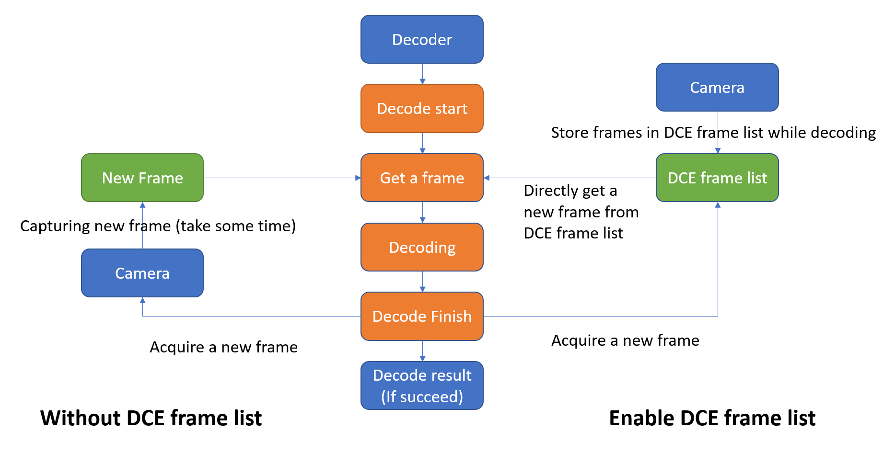

# Introductions

## Overview of Dynamsoft Camera Enhancer

Dynamsoft Camera Enhancer (DCE) is an SDK specifically designed for improving video frame decoding. Before video frames are transferred for decoding, DCE will do a series of preprocessing including camera control and frame filter. This step can largely reduce the rate of misreading. You can start your decode program development with DCE and also you can import DCE algorithm in your developed app to improve its performance. 

## Main features

1. Auto focus

    If the device's default auto focus is not sensitive enough, DCE can provide a specially design auto focus mode that can largely improve camera focus efficiency. Diversiform APIs also enable user to make personalized focus settings to reach various requirements.

2. Sensor control

    Before decoder decode on video stream, DCE sensor control can filter out all the blurry frames that are created when the device is shaking. APIs are available on enabling or disabling sensor control, set sensor sensitivity and check sensor status.

3. Frame filter and frame list

    DCE implement pre-treatment on all frames before they are transferred to decoder. The treated frames will be stored in DCE frame list and send to decoder the newest one when it finish decoding on a previous frame. APIs are available on enabling frame filter, setting camera frame rate and check frame filter status.

    

        

        
How DCE works

    

4. Auto zoom

    Under the help of barcode region predition mode of Dynamsoft Barcode Reader, if the lastest decoded frame is predicted to contain a barcode but fail on decoding, DCE will control the camera to zoom in to approach the predicted barcode region.

## DCE working process

The following chart illustrates DCE working process.

    

    
DCE working process

## Programming language 

Dynamsoft Camera Enhancer is now available for following programming languages:

- Java (Android)
- Objective-C & Swift (iOS)

## About this documentation

This documentation aims at helping you on learning, understanding and using Dynamsoft Camera Enhancer. In this documentation you can find useful information that guide you step by step from installation to further development. 

## Quick links

- [Get and set up license]({{site.introduction-license}}License.html)
- [Programming guides]({{site.programming}})
- [Get help on debugging]({{site.trouble-shooting}})
- [Contact us]({{site.contact-us}})
